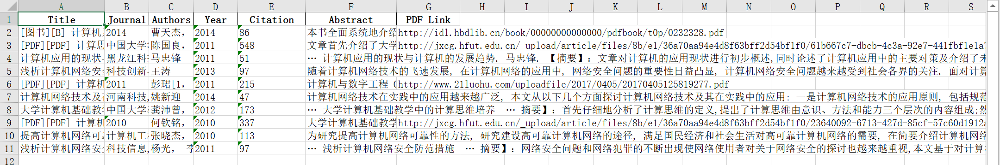
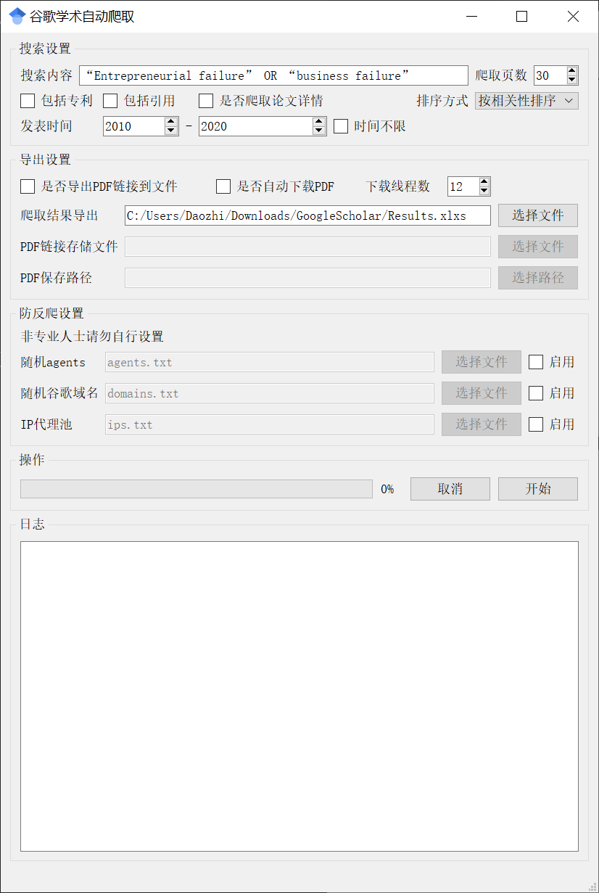
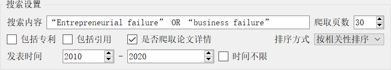
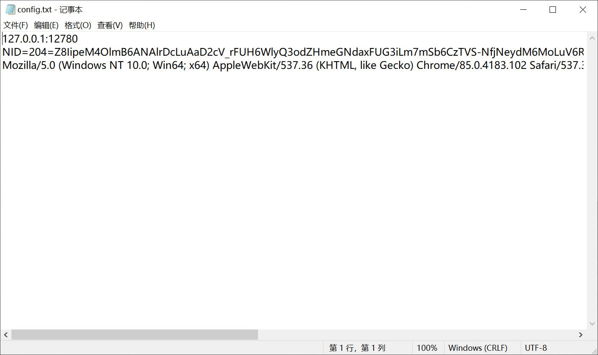

# GoogleScholarGUI
谷歌学术爬虫GUI版本。    
该软件仅用来演示爬取谷歌的技术，不可用于非法的爬虫用途，由于不当使用该软件产生的一切法律纠纷均与本人无关。    
本程序可以爬取到的字段示意：    

## 一、开发环境
**Python版本：**：Python 3.7    
**GUI框架**：PyQt5    
**使用到的其他依赖**：    
- requests    
- requests[socks]    
- lxml    
- pandas    
- retrying    
- xlrd    

## 二、使用教程
1. 安装版本直接双击即可安装，安装完成后双击打开GoogleScholar.exe，就可以看到以下界面：

2. 搜索设置：
在搜索设置区域根据要搜索的内容设置合适的参数，例如：

3. 导出设置：
如果要将PDF链接导出到一个单独的txt文件请勾选导出PDF链接到文件复选框并选择PDF链接存储文件，导出链接后可以导入第三方的批量下载软件进行快速下载    
如果要自动下载PDF文件请勾选自动下载PDF复选框并选择PDF保存路径，软件会将PDF下载到指定的文件夹中。    
下载线程数可以根据自己的电脑性能合理分配。    
4. 防反爬设置：
谷歌为了防止爬虫，采取了很多反爬措施，如果不进行防反爬处理只能爬到很少的文献就被谷歌识别为爬虫代码，主要设置以下三种防反爬：随机agents，随机谷歌域名和IP代理池，根据自己的需要选择相应的文件并勾选后面的启用就可以设置完成。此项非专业人士请勿自行设置。如果不想使用IP代理池和随机agents可以不勾选复选框，需要配置config.txt文件（config.txt文件放在安装目录下的config文件夹中），如下图：

该文件一共包含三行内容，第一行为代理地址，不使用IP代理池时必须设置要不然国内访问不了谷歌学术；第二行为agents设置，不使用随机agents时设置，不需要设置时需要留空。第三行为谷歌的cookie，可以选择性设置，不设置时第三行留空；    
1. 开始爬取，设置好以上参数就可以点击开始按钮开始爬虫了，软件将会自动运行。
注意：编译好的exe可能存在一些兼容性问题导致开始爬虫后没有反应，可以直接下载源码运行Interface.py启动软件进行操作（需要自己安装Python并配置依赖）。
## 三、目前存在的问题
1. PDF下载功能存在缺陷，有些链接不能正常下载，多线程下载功能还在开发中，后续会不断完善；
2. 在论文详情解析的过程中，由于没有对一些数据库做适配，可能出现有写论文的详情爬取不完整的情况。
3. 潜在的Bug正在寻找与完善中，欢迎大家提出改进的意见和建议。
## 四、联系方式
- 邮箱：daozhixs@gmail.com    
- QQ：1725805106    
